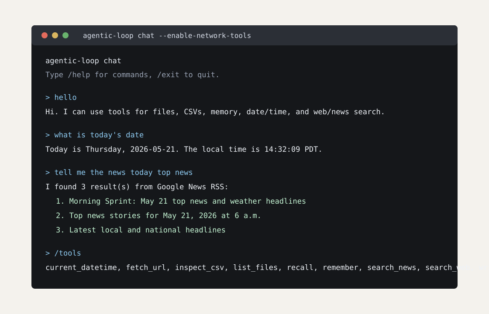
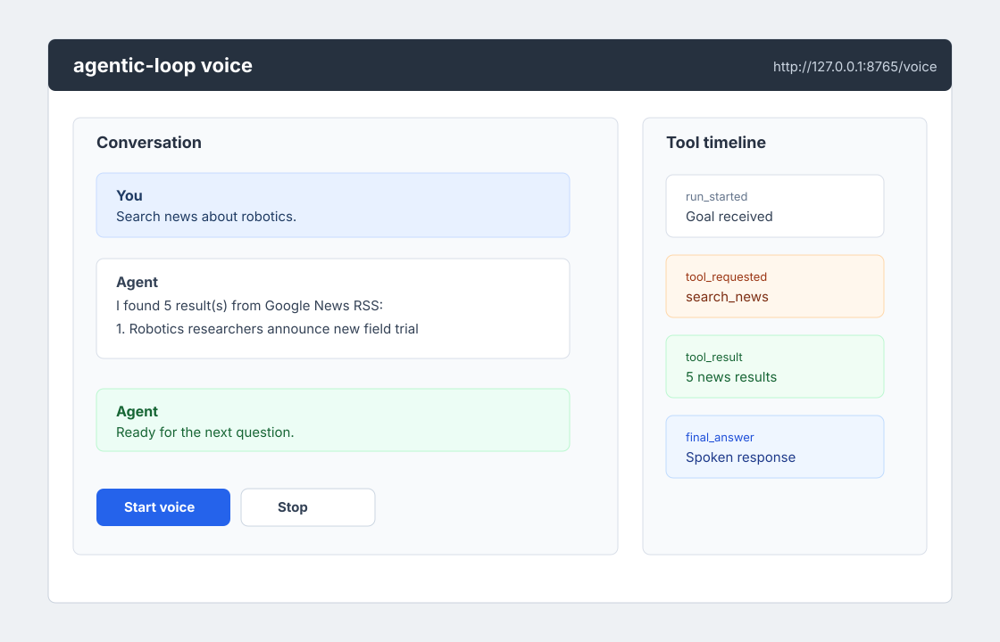
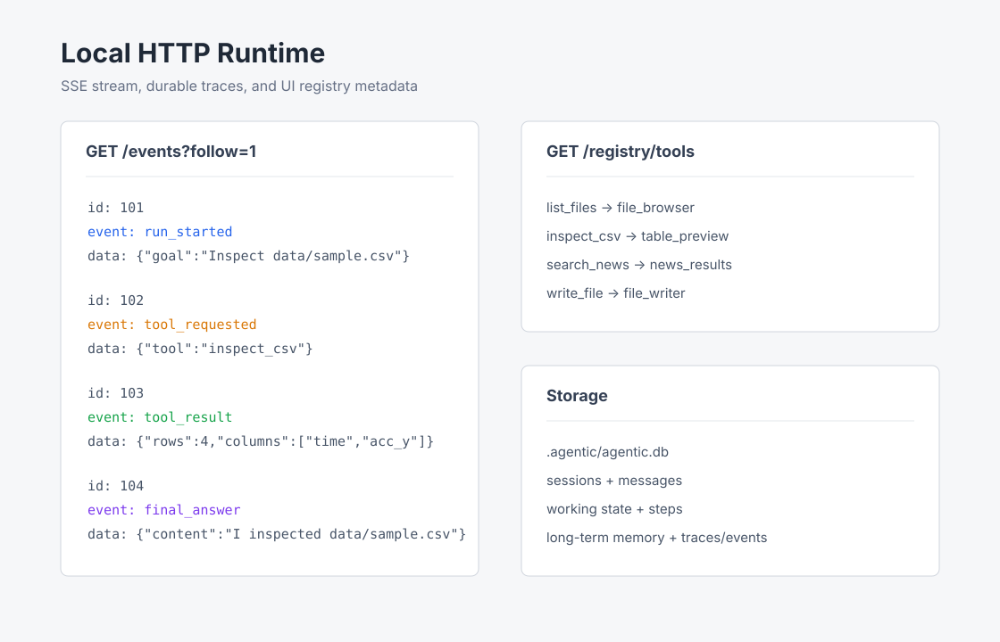

# Example Screenshots

These checked-in SVGs are illustrative examples of the current CLI, HTTP/SSE,
and browser voice surfaces. They are meant for README/docs previews without
requiring a screenshot automation dependency.

## Terminal Chat



Shows continuous CLI chat with `--enable-network-tools`, including tool-backed
news search and current date handling.

## Browser Voice Mode



Shows the embedded `/voice` page shape: transcript, controls, and tool timeline
around the same `/chat` runtime.

## Event Stream And Registries



Shows the local HTTP service exposing event streams and registry metadata for a
future frontend timeline.

## Recreate The Flows

Run terminal chat:

```bash
python3 -m agentic_loop chat --enable-network-tools
```

Run the service:

```bash
python3 -m agentic_loop serve \
  --host 127.0.0.1 \
  --port 8765 \
  --enable-network-tools
```

Open:

```text
http://127.0.0.1:8765/voice
```

Inspect event output:

```bash
curl -N "http://127.0.0.1:8765/events?follow=1&timeout=30"
curl -s http://127.0.0.1:8765/registry/tools
curl -s http://127.0.0.1:8765/registry/ui
```
